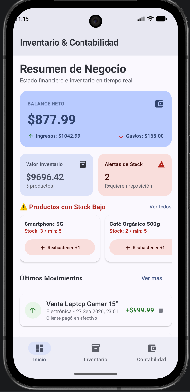
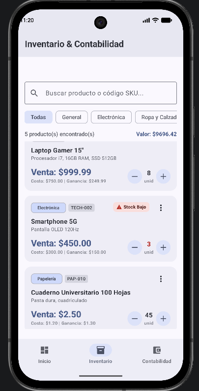
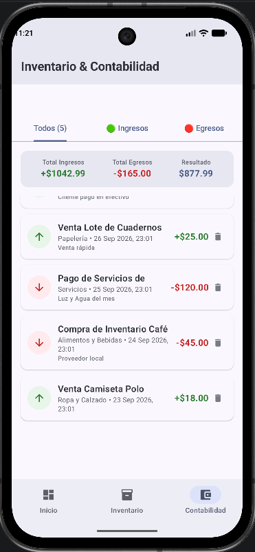

#  Inventario & Contabilidad App

> **Gestión Inteligente de Inventario y Control Financiero en Tiempo Real**  
> Una aplicación Android moderna, intuitiva y potente desarrollada con **Jetpack Compose** y **Material Design 3**, diseñada para pequeños y medianos negocios que necesitan sincronizar su stock y contabilidad sin complicaciones.

---

##  Características Principales

### 📈 1. Panel de Control (Dashboard)
- **Métricas Financieras en Tiempo Real:** Visualización instantánea del Balance Neto, Ingresos Totales, Gastos y Valor Total del Inventario.
- **Alertas de Stock Bajo:** Identificación automática de productos que requieren reposición urgente.
- **Acciones Rápidas:** Botón de reabastecimiento directo (`+1 stock`) y accesos rápidos a las secciones de Inventario y Contabilidad.
- **Historial Reciente:** Registro directo de las últimas transacciones comerciales ejecutadas.

###  2. Gestión de Inventario
- **Catálogo Completo:** Visualización detallada de productos con SKU, precio de compra, precio de venta y niveles de stock.
- **Búsqueda y Filtros Avanzados:** Búsqueda rápida por nombre o código SKU y filtrado dinámico por categorías (*Electrónica, Papelería, Ropa, Alimentos, etc.*).
- **Control de Ajuste de Stock:** Incremente o decremente el inventario con un solo toque, con la opción de generar transacciones contables automáticas.
- **CRUD de Productos:** Creación, edición y eliminación de productos con actualización automática de métricas.

###  3. Contabilidad y Transacciones
- **Registro de Ingresos y Gastos:** Clasificación de cada movimiento financiero con categoría, fecha, monto y notas detalladas.
- **Balance Financiero:** Cálculo automático de márgenes de ganancia y flujos de caja.
- **Sincronización Automática:** Las ventas y reabastecimientos actualizan tanto el inventario como el libro de contabilidad.

---

##  Vista Previa de la Aplicación

| Dashboard (Inicio) | Gestión de Inventario | Registro de Contabilidad |
| :---: | :---: | :---: |
|  |  |  |

---

## 🛠️ Arquitectura y Tecnologías Utilizadas

La aplicación está construida siguiendo las mejores prácticas recomendadas por Google para desarrollo Android moderno:

- **Lenguaje:** [Kotlin](https://kotlinlang.org/)
- **UI Framework:** [Jetpack Compose](https://developer.android.com/jetpack/compose) (100% Declarativo)
- **Sistema de Diseño:** [Material Design 3](https://m3.material.io/) (Material You)
- **Arquitectura:** Clean Architecture + MVVM (Model-View-ViewModel)
- **Gestión de Estado:** `StateFlow`, `collectAsState`, Corrutinas de Kotlin
- **Inyección / Scope:** `viewModelScope` & Repository Pattern

---

##  Instalación y Ejecución

### Requisitos Previos
- **Android Studio:** Ladybug (2024.2.1) o posterior.
- **JDK:** Java 17 o superior.
- **SDK Mínimo:** Android 8.0 (API Nivel 26).
- **SDK Objetivo:** Android 15 (API Nivel 35).

### Pasos para Ejecutar
1. **Clonar el repositorio:**
   ```bash
   git clone https://github.com/juannietoma-source/appInvetarioCont.git
   cd appInvetarioCont
   ```
2. **Abrir en Android Studio:**
   Abre Android Studio, selecciona *Open* y elige la carpeta del proyecto.
3. **Sincronizar Gradle:**
   Deja que Gradle descargue las dependencias e indexe el proyecto.
4. **Ejecutar:**
   Selecciona un emulador o dispositivo físico y presiona `Run` (`Shift + F10`).

---

## 📐 Estructura del Proyecto

```
app/src/main/java/com/example/myapplication/
├── model/                  # Modelos de datos (Product, Transaction, Category)
├── repository/             # Lógica de datos e inventario (InventoryAccountingRepository)
├── ui/
│   ├── components/         # Componentes Compose reutilizables (Tarjetas, Diálogos)
│   ├── screens/            # Pantallas (DashboardScreen, InventoryScreen, TransactionsScreen)
│   ├── theme/              # Tema Material 3, Colores y Tipografía
│   └── viewmodel/          # StateHolder y lógica de negocio (MainViewModel)
└── MainActivity.kt         # Punto de entrada y navegación principal
```

---

## 🤝 Contribuciones

¡Las contribuciones son bienvenidas! Si deseas aportar:
1. Haz un *Fork* del proyecto.
2. Crea una rama para tu función (`git checkout -b feature/nueva-funcion`).
3. Realiza tus cambios y confirma (`git commit -m 'Añade nueva función'`).
4. Sube la rama (`git push origin feature/nueva-funcion`).
5. Abre un *Pull Request*.

---

## 📄 Licencia

Este proyecto está bajo la Licencia **MIT**.
